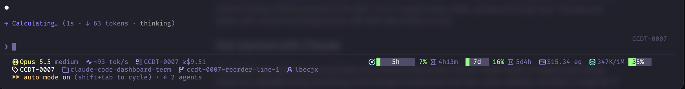

# claude-code-dashboard-term

> **Repository:** <https://github.com/lbecjx/claude-code-dashboard-term>

A compact, colored **status line for [Claude Code](https://code.claude.com)**. One small Python script that turns the session data Claude Code already gives you into a dashboard at the bottom of your terminal: which model and effort you are on, how much of your usage windows you have burned, the estimated cost, how full the context is, and where you are in git.



*The status line in [Ghostty](https://ghostty.org), mid-session. Line 1: model and effort, the 5-hour and 7-day usage bars, estimated cost, and the context window pushed to the right. Line 2: session name, folder, git branch and git user. The bars are drawn with colored cell backgrounds, with their label written on top.*

## Get started with Claude

The fastest way: paste the prompt below into Claude Code and let it do the install. It makes a backup, shows you the script, and asks before it touches your settings.

````text
Install the "claude-code-dashboard-term" status line for me, step by step. Do not change anything I have not approved.

1. Check that `python3` is available (on Windows, `python`). Tell me the version.
2. Look at my existing Claude Code status line setup: read ~/.claude/settings.json and check whether
   there is already a "statusLine" entry or a ~/.claude/statusline.py file. If either exists, make a
   timestamped backup of it (for example ~/.claude/statusline.py.bak-YYYYMMDD-HHMMSS) and tell me where it is.
3. Download the script from
   https://raw.githubusercontent.com/lbecjx/claude-code-dashboard-term/main/statusline.py
   to ~/.claude/statusline.py. Before installing it, show me what the file does (it should only read stdin,
   print to stdout and call local `git`; it must not use the network). Wait for my OK.
4. Show me the exact "statusLine" block you plan to add to ~/.claude/settings.json, merged into the existing
   JSON without removing anything else, and wait for my OK:
     "statusLine": { "type": "command", "command": "python3 ~/.claude/statusline.py", "refreshInterval": 30 }
5. Test the script with a sample payload. Download examples/demo.py from the same repository
   (https://raw.githubusercontent.com/lbecjx/claude-code-dashboard-term/main/examples/demo.py) to a temporary file,
   show me what it does (it only prints a JSON sample), then run:
     python3 /tmp/demo.py | COLUMNS=140 python3 ~/.claude/statusline.py
   and show me the output.
6. Ask me whether my terminal shows Nerd Font icons. Print this line and ask what I see:
     python3 -c "print('      ')"
   If I see boxes, question marks or nothing, set STATUSLINE_ICONS=0 in the command
   ("command": "STATUSLINE_ICONS=0 python3 ~/.claude/statusline.py") and offer to walk me through installing
   a Nerd Font (see the "Icons and Nerd Fonts" section of the project README).
7. Tell me how to undo everything (restore the backups) and that the status line updates within about
   30 seconds, without restarting Claude Code.
````

> The prompt downloads from <https://github.com/lbecjx/claude-code-dashboard-term>. If you cloned or forked the repo somewhere else, replace the URL, or tell Claude to copy `statusline.py` from your local clone instead.

## Manual install

Requirements: Python 3 (developed and tested with 3.14), and a Claude Code recent enough to support custom status lines. `git` is optional (without it, branch and user are simply not shown).

1. **Get the script.** Clone the repository (or just download `statusline.py` from <https://github.com/lbecjx/claude-code-dashboard-term>) and copy it:

   ```bash
   git clone https://github.com/lbecjx/claude-code-dashboard-term.git
   cd claude-code-dashboard-term
   mkdir -p ~/.claude
   cp statusline.py ~/.claude/statusline.py
   ```

2. **Register it** in `~/.claude/settings.json` (Windows: `%USERPROFILE%\.claude\settings.json`). Add the `statusLine` block, keeping whatever else the file already has:

   ```json
   {
     "statusLine": {
       "type": "command",
       "command": "python3 ~/.claude/statusline.py",
       "refreshInterval": 30
     }
   }
   ```

   `refreshInterval` (seconds) keeps the reset countdowns moving while you are idle. Claude Code reloads settings automatically, so there is no need to restart.

3. **Check that it works** without a live session, see [Try it without a live session](#try-it-without-a-live-session).

4. **If the icons look wrong** (boxes or `?`), follow [Icons and Nerd Fonts](#icons-and-nerd-fonts) or switch to plain text with `STATUSLINE_ICONS=0`.

> Only tested on macOS so far. It should work anywhere Claude Code and Python 3 run, but Windows has not been tried: use `python` instead of `python3` there if that is what your system provides.

## Contents

- [Get started with Claude](#get-started-with-claude)
- [Manual install](#manual-install)
- [At a glance](#at-a-glance)
- [What each part means](#what-each-part-means)
- [Icons and Nerd Fonts](#icons-and-nerd-fonts)
- [Configuration](#configuration)
- [Colors and thresholds](#colors-and-thresholds)
- [Providers](#providers)
- [Try it without a live session](#try-it-without-a-live-session)
- [Troubleshooting](#troubleshooting)
- [Issues and contributions](#issues-and-contributions)
- [Uninstall](#uninstall)
- [Privacy and safety](#privacy-and-safety)
- [Attribution and licenses](#attribution-and-licenses)
- [License](#license)

## At a glance

- **No dependencies.** One file, Python 3 standard library only.
- **No network.** It only reads the JSON Claude Code sends on stdin and, optionally, asks local `git` for the branch and user.
- **Hides what does not apply.** No usage limits from your provider? The usage group disappears. Not in a git repo? No branch, no user.
- **Fast.** A run takes a few tens of milliseconds.

## What each part means

**Line 1 — the agent**

| Part | Meaning |
|---|---|
| `Sonnet 5.5 medium` | Model and reasoning effort. The effort is gray for `low` and `medium`, and **yellow** for `high`, `xhigh` and `max`, because those use your usage faster. `Opus` is yellow too. A Bedrock model id such as `us.anthropic.claude-sonnet-5-5-20260101-v1:0` is shortened to `Sonnet 5.5`. |
| `fast` | Shown only while Claude Code's fast mode is on. |
| gauge icon + bars | The **usage group**: one icon, then the bars that exist. `5h` and `7d` are your subscription windows; `spend` is a gateway spend limit. Each bar shows the percentage used and the time until it resets. |
| `SLOW DOWN` | Shown when the 5-hour window is at 80% or more. |
| `$31.23 eq` | Estimated cost of the **current session** at API list prices (Claude Code's `cost.total_cost_usd`). It starts at $0 with every new session, including after `/clear`; it is **not** a daily or weekly total. **Not what you are billed**: on a subscription nothing is billed per token, hence "eq" (equivalent). With Opus it carries `(~2x)`, a reminder that Opus costs about twice as much per token as Sonnet. |
| `613K/1M ▓▓▓▓░░ 61%` | Context window: tokens used out of the window size, plus a bar. At 40% you get a dim `/compact soon`, at 60% `/compact`, at 80% `/clear`. Pushed to the right edge of the line. |

**Line 2 — the session**

| Part | Meaning |
|---|---|
| tag | Session name (set with `claude --name` or `/rename`, otherwise the AI-generated title). Missing until one exists. |
| folder | Name of the current directory. |
| branch | Current git branch. **Only inside a git repository.** |
| person | `git config user.name`. **Only inside a git repository**, and you can turn it off. |

**Line 3 — tokens (off by default)**: `I` fresh input, `O` output, `R` cache read, `W` cache write, for the last API call. Turn it on with `STATUSLINE_TOKENS=1`.

## Icons and Nerd Fonts

The icons are [Octicons](https://primer.style/foundations/icons) (GitHub's icon set) as they ship **inside [Nerd Fonts](https://www.nerdfonts.com) v3**. The script does not bundle any font: it only prints the characters. Whether you see an icon or a box depends on the font your terminal uses.

| Your terminal | What to do |
|---|---|
| **[Ghostty](https://ghostty.org)** | Nothing. It embeds the Nerd Font symbols and falls back to them for any missing character. |
| **Anything else** (macOS Terminal, iTerm2, Windows Terminal, VS Code, GNOME Terminal, ...) | Install a Nerd Font **v3 or newer** and select it as your terminal font, as described below. |
| Do not want to install anything | Use plain text: `STATUSLINE_ICONS=0`. |

### 1. Install a Nerd Font

Pick any font from the [download page](https://www.nerdfonts.com/font-downloads). `JetBrainsMono Nerd Font` is a good default. Use the **v3.x** release.

**macOS (Homebrew)**

```bash
brew install --cask font-jetbrains-mono-nerd-font
```

Every Nerd Font has its own cask (`brew search nerd-font` lists them). Without Homebrew, download the `.zip` from the download page, open the `.ttf` files and click *Install Font*.

**Windows**

The Nerd Fonts project documents two community package managers (they are *unofficial* repositories):

```powershell
# Chocolatey
choco install nerd-fonts-hack

# Scoop
scoop bucket add nerd-fonts
scoop install Hack-NF
```

Or download the `.zip` from the download page, unzip it, select the `.ttf` files, right-click and choose *Install* (or *Install for all users*).

**Linux**

Nerd Fonts ships an installer script that downloads the font release you ask for (see the Nerd Fonts README for its options):

```bash
curl -s https://raw.githubusercontent.com/ryanoasis/nerd-fonts/master/install.sh -o install.sh
chmod u+x install.sh
./install.sh list            # shows the available font names
./install.sh install JetBrainsMono
```

The Nerd Fonts README also lists Homebrew casks for Linux. Or copy the `.ttf` files into `~/.local/share/fonts` and run `fc-cache -fv`.

### 2. Select the font in your terminal

Installing a font is not enough, you must choose it. Menu names change between versions, so treat these as a map rather than exact steps:

| Terminal | Where |
|---|---|
| macOS Terminal | Settings → Profiles → Text → Font → Change… |
| iTerm2 | Settings → Profiles → Text → Font |
| Windows Terminal | Settings → your profile (or *Defaults*) → Appearance → Font face |
| VS Code (integrated terminal) | Setting `terminal.integrated.fontFamily`, for example `"JetBrainsMono Nerd Font"` |
| GNOME Terminal and similar | Preferences → your profile → Text → Custom font |

Restart the terminal afterwards. Use the font's family name as your system shows it (for example `JetBrainsMono Nerd Font`, or the `Mono` variant if you want every icon to take exactly one cell).

### 3. Check it

```bash
python3 -c "print('      ')"
```

You should see a tag, a folder, a branch, a chip, a gauge, an hourglass and a card. If you see boxes or question marks, the font is not active in that terminal: re-check step 2, or use `STATUSLINE_ICONS=0`.

If the icons render but look slightly off, or the end of line 1 is clipped, see [Troubleshooting](#troubleshooting).

## Configuration

All settings are **optional environment variables**. Put them in front of the command in `~/.claude/settings.json`:

```json
{
  "statusLine": {
    "type": "command",
    "command": "STATUSLINE_ICONS=0 STATUSLINE_GIT_USER=0 python3 ~/.claude/statusline.py",
    "refreshInterval": 30
  }
}
```

| Variable | Default | Effect |
|---|---|---|
| `STATUSLINE_ICONS` | `1` (on) | `0` replaces every Nerd Font icon with plain text (`→` for reset times, `⚡` for fast mode). Use it if your terminal has no Nerd Font. |
| `STATUSLINE_GIT_USER` | `1` (on) | `0` hides the git user on line 2. When off, the script does not even call git for it. The user is only ever shown inside a git repository. |
| `STATUSLINE_TOKENS` | `0` (off) | `1` adds a third line with the last API call's tokens: `I` input, `O` output, `R` cache read, `W` cache write. |
| `STATUSLINE_FLEX` | `1` (on) | `0` stops pushing the context to the right edge of line 1; it stays next to the first block. Flex also falls back to this by itself when the terminal width is unknown or too small. |
| `STATUSLINE_MARGIN` | `8` | Cells left free on the right in flex mode. Claude Code reserves part of the row and shows its own notices there. **Raise it** (for example `12`) if the end of line 1 appears cut with `…`. |
| `STATUSLINE_ICON_CELLS` | `1` | Set to `2` if your terminal draws each icon two cells wide. It only affects the alignment calculation in flex mode. |

Related Claude Code settings (these live in the `statusLine` block, not in this script): `refreshInterval` (seconds between refreshes) and `padding` (extra horizontal spacing). See the [Claude Code status line docs](https://code.claude.com/docs/en/statusline).

Flex mode reads `COLUMNS`, which Claude Code sets to the real terminal width before it runs the script.

### Changing bar sizes, icons and colors

These are constants at the top of `statusline.py`, meant to be edited directly:

| Constant | What it controls |
|---|---|
| `BAR_5H`, `BAR_WIDTH` | Width in cells of the 5-hour bar (default 10) and of the 7d, spend and context bars (default 6). |
| `ICON` / `TEXT` | The icon (Nerd Font code point) and the plain-text replacement used for each field. |
| `TONE` | Text colors. Plain ANSI numbers follow your terminal theme, `38;5;N` values are fixed 256-color. |
| `BG` | Background colors of the filled part of a bar. |
| `level_tone(p, warn, crit)` | The thresholds: green below `warn` (50 for text, 60 for bars), amber from `warn`, red from `crit` (80). |

## Colors and thresholds

| State | Color | Applies to |
|---|---|---|
| healthy | green | percentages and bars below the warning level |
| warning | yellow | 50-79% for percentages, 60-79% for bars; `/compact`; `Opus`; effort `high`, `xhigh`, `max`; the `(~2x)` note |
| critical | red | 80% and above; `/clear`; `SLOW DOWN`; the usage icon turns red while the 5-hour window is critical |
| fast mode | orange | the rocket and the word `fast` |
| empty part of a bar | gray | background |

The green and the yellow are **fixed 256-color values** (`#5fd75f` and `#ffd700`) on purpose: the plain ANSI "yellow" of some themes is actually a lime green and gets confused with healthy green.

## Providers

What you see depends on what Claude Code sends, which depends on how you authenticate:

| How you use Claude Code | Usage bars | Cost |
|---|---|---|
| Claude **Pro / Max** subscription | `5h` and `7d` windows (after the first response of a session) | shown as `eq` |
| **Amazon Bedrock**, direct API | none: Claude Code sends no subscription limits, so the usage group is hidden | shown if Claude Code computes it |
| Behind a **Claude apps gateway** with a spend limit | a `spend` bar (needs Claude Code 2.1.251 or later) | shown as `eq` |

Nothing in the status line knows your AWS or API balance: Claude Code does not expose it. For a real spending limit on Bedrock use your cloud provider's budget alerts.

## Try it without a live session

`examples/demo.py` prints a sample payload with the fields Claude Code sends:

```bash
python3 examples/demo.py | python3 statusline.py
python3 examples/demo.py --critical | python3 statusline.py       # 5h window almost exhausted
python3 examples/demo.py --opus --fast | python3 statusline.py
python3 examples/demo.py --bedrock | python3 statusline.py        # no limits, long model id
python3 examples/demo.py --spend | python3 statusline.py          # gateway spend limit
```

Add `STATUSLINE_ICONS=0` in front to see the plain-text version, and `COLUMNS=140` to see the right-aligned layout (your shell may not export `COLUMNS` on its own).

## Troubleshooting

| Symptom | Cause and fix |
|---|---|
| Boxes or `?` instead of icons | The terminal font has no Nerd Font glyphs. See [Icons and Nerd Fonts](#icons-and-nerd-fonts), or set `STATUSLINE_ICONS=0`. |
| The end of line 1 is cut with `…` | Claude Code reserves space on the right. Raise `STATUSLINE_MARGIN`. |
| Icons overlap the text | Your terminal draws icons two cells wide. Use a `Mono` Nerd Font variant, or set `STATUSLINE_ICON_CELLS=2`. |
| No `5h` / `7d` bars | They only exist with a Pro / Max subscription, and only after the first response of a session. With Bedrock or an API key they never exist. |
| No branch and no user | You are not inside a git repository, or `git` is not installed. This is intentional. |
| No session name | None has been set yet. Use `claude --name "..."` or `/rename`. |
| Nothing shows up at all | Run `python3 examples/demo.py \| python3 statusline.py`. If that prints, the script is fine and the problem is the `statusLine` block in `settings.json`. |

## Issues and contributions

Found a bug, a terminal where it looks wrong, or a provider whose data it does not handle? Open an issue at <https://github.com/lbecjx/claude-code-dashboard-term/issues>, ideally with the output of `python3 examples/demo.py | python3 statusline.py` and your terminal and font.

## Uninstall

1. Remove the `statusLine` block from `~/.claude/settings.json` (or restore the backup you made).
2. Delete `~/.claude/statusline.py` (or restore your previous one).

## Privacy and safety

- The script reads **only** the JSON on its standard input and writes **only** to standard output.
- It makes no network connections and writes no files.
- It runs `git` locally, with a one-second timeout each, to learn whether you are in a repository (`git rev-parse --is-inside-work-tree`), the branch (`git branch --show-current`) and the user (`git config user.name`). Set `STATUSLINE_GIT_USER=0` to skip the last one.
- Screenshots of the status line can show your git user name and branch. Turn the user off before sharing one.

As with any script you run on every refresh, read it before installing it. It is a single short file.

## Attribution and licenses

- **Icons.** [Octicons](https://github.com/primer/octicons) by GitHub, licensed MIT (Copyright GitHub, Inc.). This project does **not** bundle or redistribute them: the script prints Unicode code points, and your terminal draws them from the Nerd Font you installed. The code points come from the [Nerd Fonts](https://github.com/ryanoasis/nerd-fonts) glyph table (v3.5.1).
- **Nerd Fonts.** [Nerd Fonts](https://www.nerdfonts.com) patches developer fonts with icon sets. Its patched fonts are under the SIL Open Font License 1.1 and its scripts under MIT; each icon set it includes keeps its own license. If you redistribute a Nerd Font, follow the licenses that ship with it.
- **Claude Code** is a product of Anthropic. This project is an independent community script, and is not affiliated with, endorsed by or supported by Anthropic or GitHub.
- The input format is the one documented in the [Claude Code status line docs](https://code.claude.com/docs/en/statusline).

## License

Copyright (C) 2026 lbecjx

This program is free software: you can redistribute it and/or modify it under the terms of the GNU General Public License as published by the Free Software Foundation, either version 3 of the License, or (at your option) any later version. See [LICENSE](LICENSE) for the full text.

This program is distributed in the hope that it will be useful, but WITHOUT ANY WARRANTY; without even the implied warranty of MERCHANTABILITY or FITNESS FOR A PARTICULAR PURPOSE.
